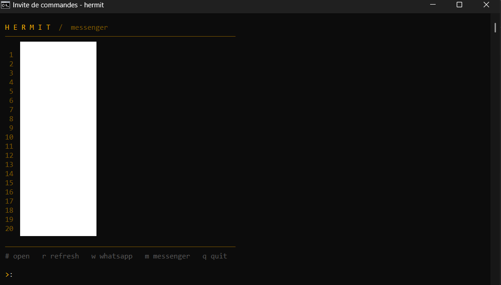

# 🐚 hermit — distraction-free terminal messenger

[](https://pypi.org/project/hermit-msg/)
[](https://pypi.org/project/hermit-msg/)
[](LICENSE)
[](https://github.com/MuTe43/hermit/actions)

**A privacy-first terminal client for Facebook Messenger and WhatsApp.**
No feeds. No algorithms. No suggested posts. Just the people you actually want to talk to.

<p align="center">
  
</p>

> Open. Reply. Close. That's it.

---

## 🤔 Why hermit?

Every time you open Messenger in a browser you get a news feed, stories,
reels, and notification badges engineered to keep you scrolling.

**hermit strips all of that away.** It's a lightweight TUI (Terminal User Interface) that gives you
**only your messages** — no distractions, no tracking, no dark patterns. Built for people who practice
[digital minimalism](https://en.wikipedia.org/wiki/Digital_minimalism) or just want their time back.

## ✨ Features

- 🚫 **Distraction-free** — no feeds, no stories, no reels, just conversations
- 📱 **Multi-platform** — Facebook Messenger and WhatsApp in one terminal
- 🔒 **Privacy-first** — nothing leaves your machine, no backend, no cloud, no data collection
- 🔑 **Persistent sessions** — log in once, stay logged in
- ⚡ **Lightweight** — headless browser under the hood, clean TUI on top
- 🧩 **Extensible** — add new platforms with a simple Python class

## 📋 Supported platforms

| Platform | Status |
|----------|--------|
| Facebook Messenger | ✅ Supported |
| WhatsApp | ✅ Supported |
| Instagram DMs | 🔜 Planned |
| Telegram | 🔜 Planned |
| iMessage (macOS) | 🔜 Planned |

## 📦 Install

```bash
pip install hermit-msg
playwright install chromium
```

> **Requirements:** Python 3.10+ • Works on Windows, macOS, and Linux

## 🚀 Quick start

### First time setup

```bash
# Log into Messenger (opens a browser window once)
hermit login fb

# Log into WhatsApp (scan QR code once)
hermit login wa
```

Sessions are saved locally at `~/.hermit/`. You only do this once.

### Usage

```bash
hermit              # launch the TUI
hermit status       # check which platforms are logged in
hermit logout fb    # clear Messenger session
hermit logout       # clear all sessions
hermit version      # show version
```

### Keyboard shortcuts

| Key | Action |
|-----|--------|
| `1-20` | Open conversation |
| `r` | Refresh |
| `w` | Switch to WhatsApp |
| `m` | Switch to Messenger |
| `b` | Back to conversation list |
| `q` | Quit |

## ⚙️ How it works

hermit runs a headless Chromium browser in the background via [Playwright](https://playwright.dev/).
It logs in once, saves your session to `~/.hermit/`, and scrapes the messaging interface —
giving you a clean terminal UI with none of the surrounding noise.

**Nothing leaves your machine.** No backend, no cloud, no accounts.

```
┌──────────────┐     ┌──────────┐     ┌───────────────────┐     ┌─────────────────┐
│ Your terminal│ ◄──►│  hermit  │ ◄──►│ Headless Chromium │ ◄──►│ messenger.com   │
└──────────────┘     └──────────┘     └───────────────────┘     │ web.whatsapp.com│
                                                                 └─────────────────┘
```

## 🧩 Adding platforms

Each platform is a simple Python class. Implement 4 methods:

```python
from hermit.platforms.base import Platform, Message, Conversation

class MyPlatform(Platform):
    name = "myplatform"

    async def login(self) -> bool: ...
    async def get_conversations(self) -> list[Conversation]: ...
    async def get_messages(self, convo_id: str) -> list[Message]: ...
    async def send_message(self, convo_id: str, text: str) -> bool: ...
```

Then register it in `hermit/app.py`. PRs welcome!

## 🗺️ Roadmap

- [ ] Instagram DMs
- [ ] Telegram (via official API — no scraping needed)
- [ ] iMessage (macOS, via AppleScript)
- [ ] Unread count badges
- [ ] Desktop notifications for new messages
- [ ] Image previews
- [ ] Group chat management

## ⚠️ Caveats

- Uses browser automation — against Messenger/WhatsApp ToS
- May break when platforms update their UI (open an issue if so)
- WhatsApp requires your phone to stay connected to the internet
- Facebook may occasionally ask you to re-login

## 🤝 Contributing

Bug fixes and new platform adapters very welcome. See [CONTRIBUTING.md](CONTRIBUTING.md).

## 📄 License

MIT

---

<p align="center">
<i>Built because opening Messenger to reply to one message and losing 45 minutes is not acceptable.</i>
<br><br>
If hermit saved you from doomscrolling, consider giving it a ⭐
</p>
